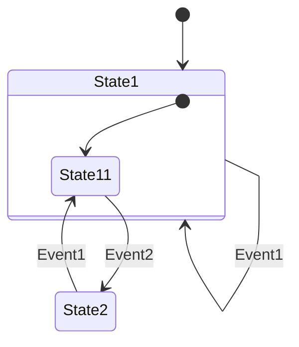

# hsm-rs

hsm-rs is a hierarchical state machine (hsm) implementation in rust (rs). The development of this state machine framework was inspired by the [QuantumLeaps](https://www.state-machine.com/) state machine framework developed by Miro Samek, and is arguably a partial port of the framework to Rust. The goals of this framework was to provide a no_std/no allocation state machine framework in Rust, balancing the goals of being idiomatic, suitable for embedded development, and behaviorally equivalent to the quantum leaps state machine framework, especially regarding transition semantics.

This project started primarily to build the author's familiarity with Rust, so feedback and suggestions are certainly welcome. 

The API for hsm-rs is similar to the older [kaori-hsm](https://docs.rs/kaori-hsm/latest/kaori_hsm). This similarity is accidental, as the API was largely shaped prior to the discovery of kaori-hsm by the author. Some of the key differences between the two frameworks are:
- Use of structs (manual vtables) implemented using the sealed trait pattern for dispatch in hsm-rs vs hidden trait function for dispatch in kaori-hsm
    - Please note that I have not performed any code-size, memory, or performance benchmarking between the two, so this first point is merely a note
- Encoding of Parent relationships in the state hierarchy in hsm-rs to get compile-time failures for circular parent dependencies
- Optional and additional actor framework extending the state machine framework
- All state machine specifications directly in rust, no macros

The quantum leaps website provides more resources for understanding hierarchical state machines than I could possibly cover here so I will defer to the content there for explaining the foundational concepts. In particular his free book [Practical UML Statecharts in C/C++](https://state-machine.com/psicc2), is quite comprehensive.

## Features
- Hierarchical state machine framework + event dispatch
- Optional actor framework
- Optional actor runtime scheduling disciplines
- no_std
- Embedded first

### Roadmap

There is currently no particular order for implementing these features, however the following work is planned: 
- Preemptive scheduler runtime (only to be supported with backing RTOS)
- Example with RTOS integration including RTOS queues adapted
- Investigate cooperative scheduler using signals from ready/enqueue instead of scanning
    - This may not be implemented as Initial investigations were performed, but this proved difficult

## Example

The following example demonstrates all of the basic state machine features of hsm-rs. For examples of the optional features including the actor framework please see the docs. For more advanced examples including embedded targets, please see the examples folder.

To implement the following state machine, and exercise all transitions:



You can implement the following:
```rs
use hsm_rs::{
    Action, State, StateDef, StateMachineDef, StateMachine, StateRef, Super, Top,
};

enum TestEvent {
    Event1,
    Event2,
}

struct TestActor;

impl StateMachineDef for TestActor {
    type Event = TestEvent;

    fn initial(&mut self) -> State<Self> {
        println!("TestActor Initial");
        State1::state()
    }
}

struct State1;

impl StateDef<State1> for TestActor {
    type Parent = Top;

    fn initial(&mut self) -> Option<State<Self>> {
        println!("State1 Initial");

        Some(State11::state())
    }

    fn entry(&mut self) {
        println!("State1 Entry");
    }

    fn handler(&mut self, event: &TestEvent) -> Action<Self> {
        println!("State1 Handler");

        match event {
            TestEvent::Event1 => Action::Handled,
            _ => Action::Unhandled,
        }
    }

    fn exit(&mut self) {
        println!("State1 Exit");
    }
}

struct State11;

impl StateDef<State11> for TestActor {
    type Parent = Super<State1>;

    fn initial(&mut self) -> Option<State<Self>> {
        println!("State11 Initial");

        None
    }

    fn entry(&mut self) {
        println!("State11 Entry");
    }

    fn handler(&mut self, event: &TestEvent) -> Action<Self> {
        println!("State11 Handler");

        match event {
            TestEvent::Event2 => Action::Transition(State2::state()),
            _ => Action::Unhandled,
        }
    }

    fn exit(&mut self) {
        println!("State11 Exit");
    }
}

struct State2;

impl StateDef<State2> for TestActor {
    type Parent = Top;

    fn initial(&mut self) -> Option<State<Self>> {
        println!("State2 Initial");

        None
    }

    fn entry(&mut self) {
        println!("State2 Entry");
    }

    fn handler(&mut self, event: &TestEvent) -> Action<Self> {
        println!("State2 Handler");

        match event {
            TestEvent::Event1 => Action::Transition(State11::state()),
            _ => Action::Unhandled,
        }
    }

    fn exit(&mut self) {
        println!("State2 Exit");
    }
}

fn main() {
    let mut test_actor = TestActor{};
    let mut sm = StateMachine::new().initial(&mut test_actor);

    // Handled Event
    sm.dispatch(&mut test_actor, &TestEvent::Event1);

    // Transition to State2
    sm.dispatch(&mut test_actor, &TestEvent::Event2);

    // Unhandled Event
    sm.dispatch(&mut test_actor, &TestEvent::Event2);

    // Transition back to State 11
    sm.dispatch(&mut test_actor, &TestEvent::Event1);
}

```
